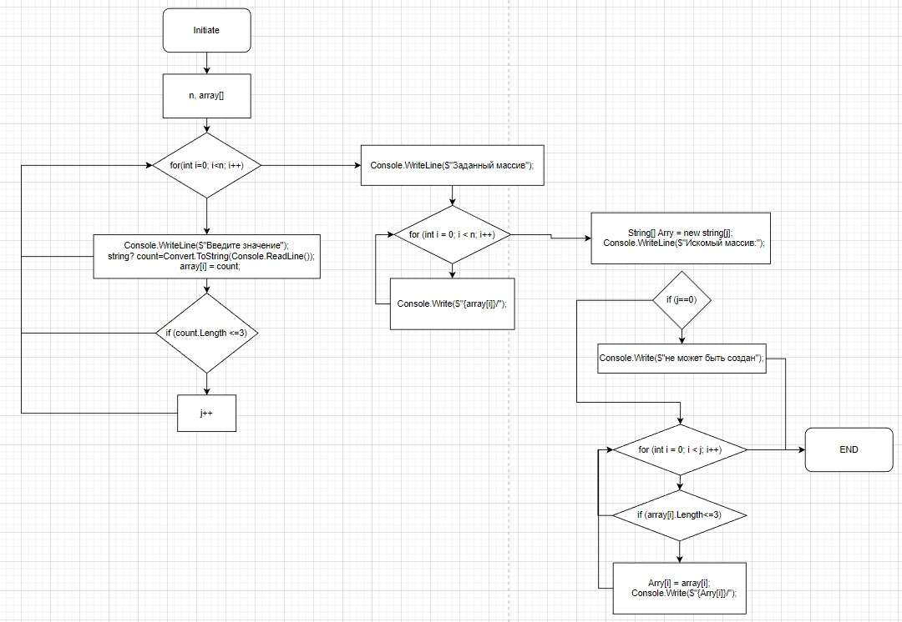

* Программа даёт пользователю задать размер массива и все его значения.
* При помощи переменной(счётчика) **j** определяется размер необходимого массива.
* Затем создаётся и заполняется новый массив по условию **if** (array[i]<=3)
_**Блок схема решения:**_
